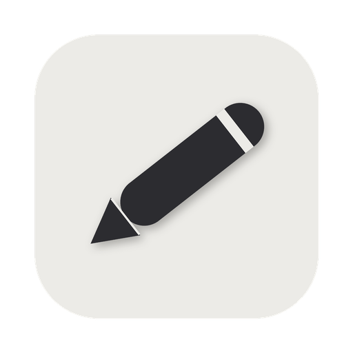

<div align="center">



# iNotes

A minimal macOS menu-bar **markdown scratchpad**. Lives in your menu bar, opens with a keystroke, saves as plain markdown.

**This app was developed entirely by Claude (Anthropic's AI), directed by a human over a series of conversations.**


</div>

## Features

- **Menu-bar only** — no dock icon, no clutter; open/close with a click or a global hotkey
- **Markdown editor with live preview** — type plain markdown and it styles as you go:
  - `# heading` renders large; the `#` hides
  - `**bold**`, `*italic*`, `` `code` `` style inline; the markers hide (unclosed markers stay visible)
  - `- ` bullets render as `•` / `◦` / `▪` by indent depth
  - `- [ ]` / `- [x]` render as clean `☐` / `☑` checkboxes — click to toggle
- **Notes are portable plain text** — stored as literal markdown in `notes.json`, readable anywhere
- **Up to 5 tabs** — add, delete, drag to reorder, pin (📌 floats to front), double-click to rename
- **Status footer** — live word / character count and an "edited N ago" timestamp
- **Find** — `Cmd+F` in-note search
- **Adjustable text size** — `A−` / `A+` in the formatting toolbar; scales text, headings, and checkboxes
- **Global hotkey** — `Cmd+Shift+L` by default (configurable via the right-click menu)
- **Auto-updates** — via [Sparkle](https://sparkle-project.org) (direct-download build)
- **Light / dark** — follows the system theme

## Install

### Download
1. Grab the latest `iNotes.zip` from [Releases](../../releases)
2. Unzip and drag `iNotes.app` into `/Applications`
3. First launch: macOS may warn about an unidentified developer — right-click the app → **Open** to bypass

Once installed, the app keeps itself up to date via Sparkle.

### Build from source
```bash
brew install xcodegen
git clone https://github.com/spacegrowth/inotes.git
cd inotes
xcodegen generate
xcodebuild -scheme iNotes -configuration Release -destination 'platform=macOS' build
```
The built app lands in `~/Library/Developer/Xcode/DerivedData/iNotes-*/Build/Products/Release/iNotes.app`.

## Usage

- **`Cmd+Shift+L`** — toggle the panel from anywhere (or click the pencil in the menu bar)
- **Right-click** the menu-bar icon — change the shortcut, check for updates, or quit
- **`+`** — new note (up to 5); **double-click** a tab to rename; **drag** to reorder; **right-click** a tab to pin or delete
- **`Cmd+B` / `Cmd+I`** — wrap the selection in `**` / `*`; **`Cmd+F`** — find
- Type `- [ ] ` for a checkbox, then click it to toggle
- Notes save automatically to `~/Library/Application Support/iNotes/notes.json`

## Tech

- **SwiftUI + AppKit** — custom `NSPanel` (menu-bar popover), `NSTextView` editor, Carbon global hotkey
- **Live markdown rendering** — a custom `NSLayoutManager` substitutes glyphs (`•`, `☐`/`☑`) and collapses hidden syntax to zero width, all without touching the source characters (the file stays literal markdown)
- **[Sparkle](https://sparkle-project.org)** — auto-updates for the direct-download build, isolated behind a `SPARKLE_UPDATES` compile flag so a sandboxed App Store build can exclude it (see [`DISTRIBUTION.md`](DISTRIBUTION.md))
- **XcodeGen** — the `.xcodeproj` is generated from `project.yml`
- 103 unit tests

## License

MIT — do whatever you want with it.
